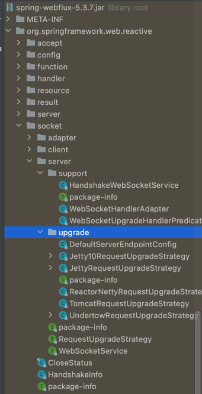

# Spring integration webflux demo as war file

## Spring reactive WebSocket and Spring integration

### Maven dependencies:
```xml
<dependencies>
 ...
 <dependency>
  <groupId>org.springframework.boot</groupId>
  <artifactId>spring-boot-starter-webflux</artifactId>
 </dependency>
 <dependency>
  <groupId>org.springframework.integration</groupId>
  <artifactId>spring-integration-webflux</artifactId>
 </dependency>
 ...
</dependencies>
```

### Implementation

To make server realize incoming request, add route to specific handler. Below is how to add router for index.html and websocket endpoint:

```java
class ReactiveWebConfiguration {
    @Bean
    public RouterFunction<ServerResponse> htmlRouter(@Value("classpath:/static/index.html") Resource html) {
     return route(
             GET("/"),
             request -> ok()
                     .contentType(MediaType.TEXT_HTML)
                     .bodyValue(html)
            ).andRoute(GET("index.html"),
             request -> ok()
                     .contentType(MediaType.TEXT_HTML)
                     .bodyValue(html));
    }
   
    @Bean
    public HandlerMapping handlerMapping(IntegrationFlowWebSocketHandler integrationFlowWebSocketHandler) {
     Map<String, WebSocketHandler> map = new HashMap<>();
     map.put("/time/**", integrationFlowWebSocketHandler);
     map.put("/time**", integrationFlowWebSocketHandler);
   
     SimpleUrlHandlerMapping mapping = new SimpleUrlHandlerMapping();
     mapping.setUrlMap(map);
     mapping.setOrder(-1); // before annotated controllers
     return mapping;
    }
}

```

Notice class IntegrationFlowWebSocketHandler. This is implemented WebSocketHandler. In this demo, IntegrationFlow is defined here. 
This class handle websocket request/response as well.

```java
public class IntegrationFlowWebSocketHandler implements WebSocketHandler {
   @Override
   public Mono<Void> handle(WebSocketSession session) {
    session.receive().subscribe(webSocketMessage -> {
     // handle request's payload 
    });
    
    
    
    // outFlux is outbound websocket channel, streaming data
    return session.send(outFlux);
   }
   
}
```
Integration flow
```java
    // input can be Flux, MessageSource, Inbound message channel
    Flux<Message<?>> input = dataService.getMessages().map(m -> MessageBuilder.withPayload(m).build());

    Publisher<Message<WebSocketMessage>> messagePublisher =
            IntegrationFlows.from(input)
//                        .<Map>filter(p -> symbol.get().equals(String.valueOf(p.get("symbol"))))
                    .<Map>handle((p,h) -> {
                     String fmtTime = DateFormat.getDateTimeInstance(DateFormat.LONG, DateFormat.DEFAULT).format(new Date());
                     p.put("time", fmtTime);
                     return p;
                    })
                    .<Map, Message<WebSocketMessage>>transform(p -> {
                     log.debug("transform to WebSocketMessage: {}", p);
                     return MessageBuilder.withPayload(session.textMessage(gson.toJson(p))).build();
                    })
                    .toReactivePublisher();
    
    // Flux output is used to publish data to client 
    Flux<WebSocketMessage> output = Flux.from(messagePublisher).map(Message::getPayload);

    IntegrationFlowContext.IntegrationFlowRegistration flowRegistration =
        this.integrationFlowContext.registration((IntegrationFlow) messagePublisher).register();
    
```

### How to run
for netty embedded, run command:
> mvn spring-boot:run -Psboot

for container netty:
> mvn clean package. 
place war file to server deployment.

Open browser:
> http://localhost:8080/ws-integration/index.html

Script file named "auto-ws.js" is used for load test, can run in browser or node.

### Link refer:
understand websocket request/response handle
> https://blog.devgenius.io/websockets-with-spring-webflux-ba9d0b47b348

Spring Websocket + webflux + integration.
https://stackoverflow.com/questions/52291206/spring-integration-and-reactive-websockets

github repo from Spring Integration author
> https://github.com/artembilan/sandbox/tree/master/spring-integration-websocket-reactive/

### How to make war file:

This is main class:
```java
/**
 * This class is needed when you run reactive webapp as deployable war
 */
public class AppInitializer extends AbstractReactiveWebInitializer {

    @Override
    protected Class<?>[] getConfigClasses() {
        return new Class[]{
                AppConfig.class,
                WebConfig.class
        };
    }

}
```
Currently, I have not made it running in websphere liberty yet.
Seems spring webflux has not supported websphere. Here is what are working with webflux.
I guess that we need a class implements org.springframework.web.reactive.socket.server.RequestUpgradeStrategy



Not sure if get rid of webflux can help or not.
